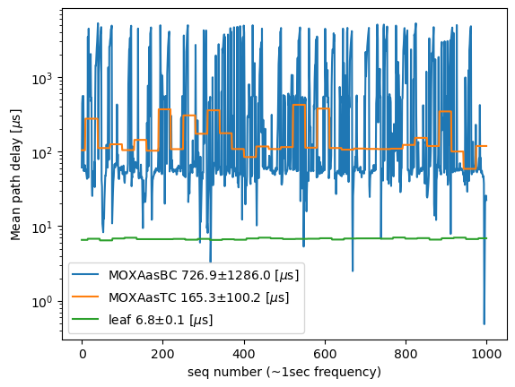
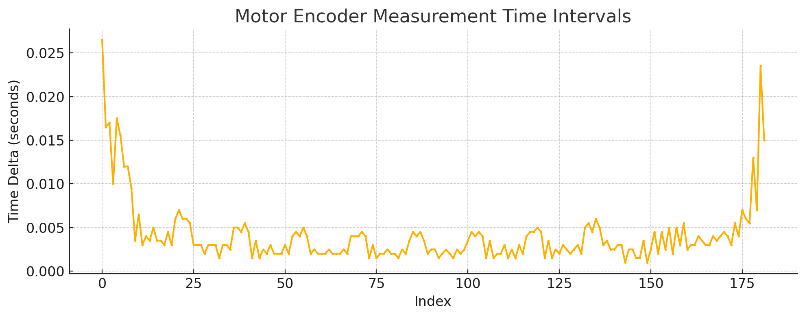

# Configuring the PTP setting on the MOXA network switch

```{abstract}
This document describes how to configure the PTP on the MOXA network switch in the Camera to prevent accidental gap in the motion profile, which left "Raised Alert MOTION (Check of motion profile using Hall data.)" in a shutter log file.
```

## Introduction
The shutter system of the LSST Camera utilizes hall sensors and motor encoders to measure the blade positions. During the testing period and the initial phase of operation following the Precise Time Protocol's implementation, a gap of approximately 10 milliseconds was observed. This document outlines the configuration, test outcomes, recommendations, and potential further optimization strategies. 

## Configuration
The Sonoma Network Time Server, equipped with a PTP/IEEE-1588 system, has been deployed at the Vera C. Rubin Observatory. This device receives GPS signals and utilizes the Precise Timing Protocol (PTP) to transport precise clocks over the Camera network. The Sonoma device functions as a Grandmaster in this network.

The Camera network comprises at least two network switches:
- the Leaf network switch
- the Moxa network switch.
The Leaf switch is configured as a Boundary clock.

The PTP client in the Camera is the Beckoff EL6688 device. This device supports a 100Mbps network, while all other networks accessible from the Moxa switch are 1Gbps.

The objective is to achieve a consistent millisecond time synchronization using PTP from GPS in a heterogeneous speed environment. 

## Analysis

We conducted a series of measurements to assess the Mean Path Delay for 1000 iterations using `readPtpDiag.sh`, employing three distinct configurations:

- **Moxa as Boundary Clock:** In this configuration, the Moxa serves as the primary clock source.
- **Moxa as Transparent Clock:** In this configuration, the Moxa functions as a transparent clock, facilitating the conversion between 100Mbps and 1Gbps.
- **Leaf Switch as Boundary Clock:** In this configuration, the Leaf Switch assumes the role of the boundary clock.



The Moxa as Boundary Clock configuration exhibited significant jitter, reaching a value of 1.2ms. This high jitter is likely the root cause of the MOTION alert. Conversely, the Moxa as Transparent Clock configuration demonstrated minimal jitter, with a value of 0.1ms. The Leaf Switch configuration, while offering a low jitter of 0.0001ms, does not account for the delay introduced by the Moxa.


While the accuracy of 0.1ms may not be the primary concern, it is worth noting that the motion profiles indicate a mean time tick of 4.06 msec and a standard deviation of 3.57 msec. Therefore, a slight deviation from this accuracy level is unlikely to have a significant impact on the overall performance.

## Recommendation
Based on these observations, it is recommended to adopt the Transparent Clock mode for the Moxa. This adjustment will be implemented in the moxa1 setting in the near future.

## Further tuning
If a jitter of 0.1 milliseconds becomes a concern, we could further optimize the network by:
- Prioritizing PTP packets on the Camera network using QoS
- Separating PTP packets to a different VLAN
This is especially important as the QoS solution might confuse the jGroups network traffic, which is the Camera control communication. Constructing a dedicated PTP VLAN is more likely to be a solution.
