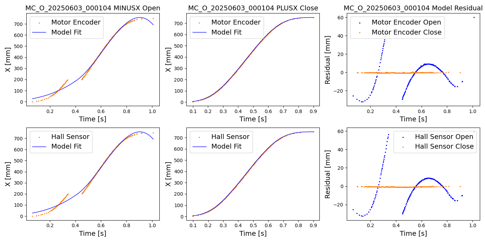

# Configuring the PTP setting on the MOXA network switch

```{abstract}
This document describes how to configure the PTP on the MOXA network switch in the Camera to prevent accidental gaps in the motion profile, which left "Raised Alert MOTION (Check of motion profile using Hall data.)" in a shutter log file. The conclusion is that no PTP role on MOXA should be given in our configuration.
```

## Introduction
The shutter system of the LSST Camera utilizes hall sensors and motor encoders to measure the timing of passing the shutter blade. During the testing period and the initial phase of commissioning following enabling the Precise Time Protocol (PTP)'s option, a gap of an order of 10 milliseconds was observed. This document outlines the configuration, test outcomes, recommendations, and potential further optimization strategies. 

## Issues
The motion profile for an exposure is shown. For one exposure, there are two profiles for opening and closing. We fit the profiles with a model to parameterize the motion profile. In the example below, there is a gap of 100 ms observed in the open motion. The closing profile is regular. The right column is the residual of the fit.  There are separate position sensors of hall and encoders. Each is shown.


In a log the following error message has been observed. This is also logged in a CCS alert viewer as a MOTION alert. 
```
[2025-06-03T16:07:13.660+0000] WARNING: Raised Alert MOTION (Check of motion profile using Hall data.) at severity WARNING 1 time. Last cause : "There were 134 Hall transitions more than 5.00000 mm off prediction.". Overall AlertState= ALARM (org.lsst.ccs.utilities.logging.Logger log)
```

## Configuration
### GPS
The Sonoma Network Time Server, equipped with a PTP/IEEE-1588 system, has been deployed at the Vera C. Rubin Observatory. This device receives GPS signals and utilizes the Precise Timing Protocol (PTP) to transport precise clocks over the Camera network. The Sonoma device functions as a Grandmaster in this network. GPS is configured as follows:

 

### Network 
The Camera network comprises at least two network switches:
- the Leaf network switch
- the Moxa network switch (EDS-G516E-T).

The Leaf switch is configured as a Boundary clock.

The PTP client in the Camera is the Beckoff EL6688 device. This device supports a 100Mbps network, while all other networks accessible from the Moxa switch are 1Gbps.

We have a spare shutter in the network too, which we used as the testbed for this report.

Logically, the network connection is made as follows:
```
[GPS/PTP] --1Gbps--> [Leaf] --1Gbps--> [MOXA1] --100Mbps--> [Beckhoff in the Camera]
                        |                 |
                        |                 +--> [testing device]
                        |                 
                        |--> [MOXA2] --100Mbps [Beckoff in the spare shutter]
                        x
                        |
                        +--> No PTP signal to the other ports on this leaf
```

The objective is to achieve a consistent millisecond time synchronization using PTP from GPS in a heterogeneous speed environment. 

## Analysis

We conducted a series of measurements to assess the Mean Path Delay for 1000 iterations using `readPtpDiag.sh` every second (controlled by a unix command sleep), employing three distinct configurations:

- **Moxa as Boundary Clock (v2 E2E BC):** In this configuration, the Moxa serves as the primary clock source.
- **Moxa as Transparent Clock (v2 E2E 2-Step TC):** In this configuration, the Moxa functions as a transparent clock, facilitating the conversion between 100Mbps and 1Gbps.
- **Leaf Switch as Boundary Clock (Disable IEEE 1588 PTP on the MOXA):** In this configuration, the Leaf Switch assumes the role of the boundary clock.


The result is shown in the figure above. The Moxa as Boundary Clock configuration exhibited significant jitter, reaching a value of 1.2ms. This high jitter is likely the root cause of the MOTION alert. Conversely, the Moxa as Transparent Clock configuration demonstrated minimal jitter, with a value of 0.1ms. The Leaf Switch configuration offers a sifnificant low jitter of 0.0001ms.


It is worth noting that the motion profiles indicate a mean time tick of 4.06 msec and a standard deviation of 3.57 msec. Therefore, a slight jitter of 0.0001ms from this accuracy level is unlikely to have a impact on the overall performance.

The plot below shows `Offset from master` for both using MOXA as TC (offset) and using the Leaf switch as BC (leaf). There is a significant improvement by the change.


## Recommendation
Based on these observations, it is recommended to disalble the MOXA's PTP, but using the leaf switch as the boundary clock.

## References
- [MOXA EDS-G516E-T manual](https://cdn-cms-frontdoor-dfc8ebanh6bkb3hs.a02.azurefd.net/getmedia/e3be8aa7-8a55-48e9-856d-ad9404200344/moxa-managed-ethernet-switch-ui-2.0-fw-5.x-user-manual-v2.7.pdf)
- [PTP EL6688](https://download.beckhoff.com/download/document/io/ethercat-terminals/el6688_en.pdf)
- [Manual for CCS Shutter System](https://docs.google.com/document/d/1k-oAwnY8rhwuz5pN1PkQU-riK-ZKio4tmEnwgZLlOFM/edit?tab=t.0#heading=h.t2ammhkqrplq)

## Appendix
### Q1: Offset from master is too large. What should I do?

```
[ccs@lsstcam-shutter02 20250608TC]$ /usr/local/bin/readPtpDiag.sh
HCU date and time:           2025-06-08 16:19:47.856438
PTP version:                 PTPv2 (32)
PTP state:                   SLAVE (9)
Clock ID (hex):              00 01 05 ff fe 3e 4c 43
Master clock ID (hex):       fc 59 c0 ff ff 21 48 03 00 1d
Grandmaster clock ID (hex):  00 0e fe ff fe 01 15 98
Offset from master (ns):     516,208,667
Mean path delay (ns):        6,913
Steps removed:               4
Sync msg sequence no.:       10713
Time scale:                  PTP/TAI (1)
Offset from UTC (sec):       37
UTC offset valid?            True
Leap61?                      False
Leap59?                      False
Epoch no.:                   0
External (PTP) time:         Mon, 14 Jul 2025 19:07:22.492342 UTC
```

#### A: Power cycling PLC/HCU will make it small and scattered around 0. (but currently it is still somehow biased by 2ms level.)
```
[ccs@lsstcam-shutter02 ~]$ /usr/local/bin/readPtpDiag.sh 
HCU date and time:           2025-06-09 17:58:35.614918
PTP version:                 PTPv2 (32)
PTP state:                   SLAVE (9)
Clock ID (hex):              00 01 05 ff fe 3e 4c 43
Master clock ID (hex):       fc 59 c0 ff ff 21 48 03 00 1d
Grandmaster clock ID (hex):  00 0e fe ff fe 01 15 98
Offset from master (ns):     -11,662
Mean path delay (ns):        122,992
Steps removed:               4
Sync msg sequence no.:       37388
Time scale:                  PTP/TAI (1)
Offset from UTC (sec):       37
UTC offset valid?            True
Leap61?                      False
Leap59?                      False
Epoch no.:                   0
External (PTP) time:         Wed, 16 Jul 2025 17:40:44.907797 UTC
```

After giving a power cycle, we still observed a steady offset of ~2 ms in the ~1000 sec statistics of offset from master. This offset could be interpreted as an asymmetric packet travel time introduced by the switch, although PTP v2 is supposed to support asymmetric paths. This was mitigated by switching from the MOXA as Transparent Clock to the leaf switch as the Boundary Clock. 

### Q2: `readPtpDiag` is a destractive command. How can I recover the shutter after running this command.

#### A2: Follow the following procedure
- Resync because it was "sync error", physical state became "OTHERS"
- click "Prod mode", the state becomes "CLOSED".

